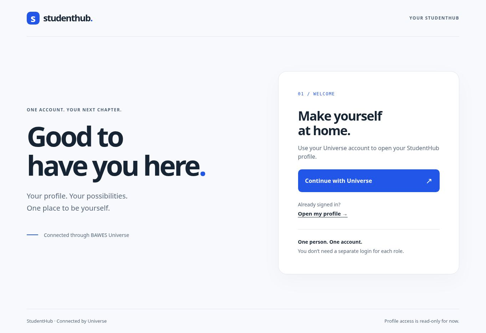
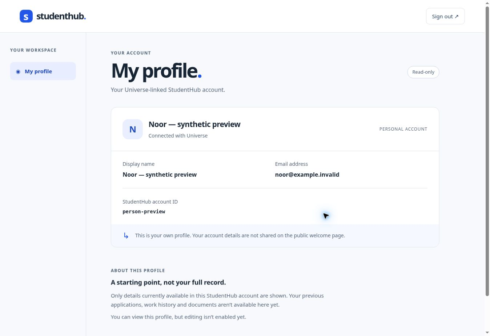
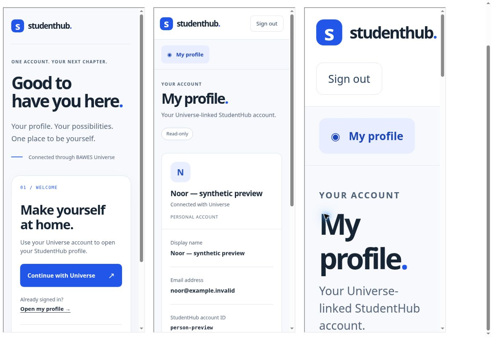

# SHU-89 author evidence

This is author evidence, not an independent PASS or a live deployment claim.
The PR supplies the exact head for the verifier. Built on `5c3ad58`, then
integrated `acbe6bf` (SHU-79): the sole conflict was the gateway constructor's
login type; its new image-derived revision parameter and health behavior remain.

## Scope and judgment calls

- Server-rendered HTML in the existing gateway, no new framework, dependencies,
  client JavaScript, identity provider, environment variables or deployment app.
- HTML profile is an opt-in representation of the existing own-profile route.
  JSON bodies and the login-contract package are unchanged.
- The public login link uses the configured, already-allowlisted same-origin
  `/profile`; it never expands the return allowlist or trusts request Host.
- Read stored name/email only after session ownership is established, checking
  the adapter's returned principal ID as well. Missing/misbound principal fails
  closed; absent individual fields are described honestly.
- Do not present `self` or a fixture's `candidate` marker as real business grants.
  Multi-grant navigation and legacy-data parity are separate cards, not implied
  by the screenshot. UI is read-only, except existing session sign-out.
- Native browser logout requires the configured Origin. Non-browser clients
  without Origin keep the existing 204 behavior; supplied hostile Origin and
  cross-site Fetch Metadata are rejected. Review this compatibility boundary.
- HTML is deliberately non-frameable for this slice. Approved embedding is
  future work, not a loosened CSP in this PR.

## Checks

- `npm run typecheck`, `npm test`, `npm run test:coordinator`, `git diff --check`.
- New HTTP suite: 13 tests, no skips. It uses real login-application logic with
  synthetic provider/session ports, not production credentials. Includes OIDC
  state/callback, session isolation, JSON negotiation, dependency failure,
  escaping and logout. The configured runtime reader also has a wiring test.
- Coordinator: 413 pass, one existing Unix-socket EPERM skip, zero failures.
  Do not describe that result as 414 passed.
- Added a real-PostgreSQL HTTP integration regression in the existing `test:db`
  suite. No local PostgreSQL server was available: **no local DB PASS claimed**.
  The PR's existing Postgres CI job and independent verifier must establish it.
- No public staging login, deployment, production data read or human acceptance
  performed here. SHU-93 owns live publication/acceptance.

## Temporary mutation probes

Each source anchor was asserted to change exactly once, the mutant built
successfully, and the HTTP suite then exited 1 with the named failure below.
All mutations were reverted and the ordinary gate rebuilt. These probes ran
before the SHU-79 integration; that merge did not alter these six controls.

| Deliberate break | Failing named test |
| --- | --- |
| Remove returned-principal ID binding | `a misbound private-profile adapter fails closed instead of displaying another person's details` |
| Make HTML escaping match no hostile characters | `HTML escapes hostile stored values and shows absent fields honestly` |
| Replace HTML no-store with public caching | `private HTML is non-cacheable, has a restrictive CSP and loads no remote assets` (also the private error-state test) |
| Stop forwarding requested person ID to authorization | `foreign person query, missing session and expired session never read private fields` |
| Remove configured-Origin mismatch rejection | `cross-site or originless browser logout cannot delete a session even with forged Host` |
| Send a different ID to the runtime principal reader | `runtime wires the browser reader to the authorized principal and uses only the exact same-origin profile return` |

The verifier should invent additional probes, not merely replay this list.

## Browser evidence

Screenshots are from the real rendered templates with **synthetic data** using
`tools/fixtures/src/web-preview.mjs`. That explicit fixture never connects to
PostgreSQL/a real provider, rejects production mode and is not copied as a
production entrypoint. Its synthetic profile path is not a gateway route.

- Desktop welcome and own-profile views inspected; no horizontal overflow.
- Responsive lab: 390px iframes, 375px content viewport with scrollbar. Both
  pages have scroll width equal to client width. Enlarged profile text measures
  32px at the root (200%), also with zero horizontal overflow. An initial
  enlarged-text check exposed a topbar overflow; wrapping fixes that defect.
- Keyboard: skip link → home → Continue with Universe → Open my profile;
  visible 3px focus outline, Enter on profile opens the signed-out message.
- This is browser layout/keyboard evidence, not an emulated mobile device or
  real-provider secure-cookie end-to-end acceptance.

